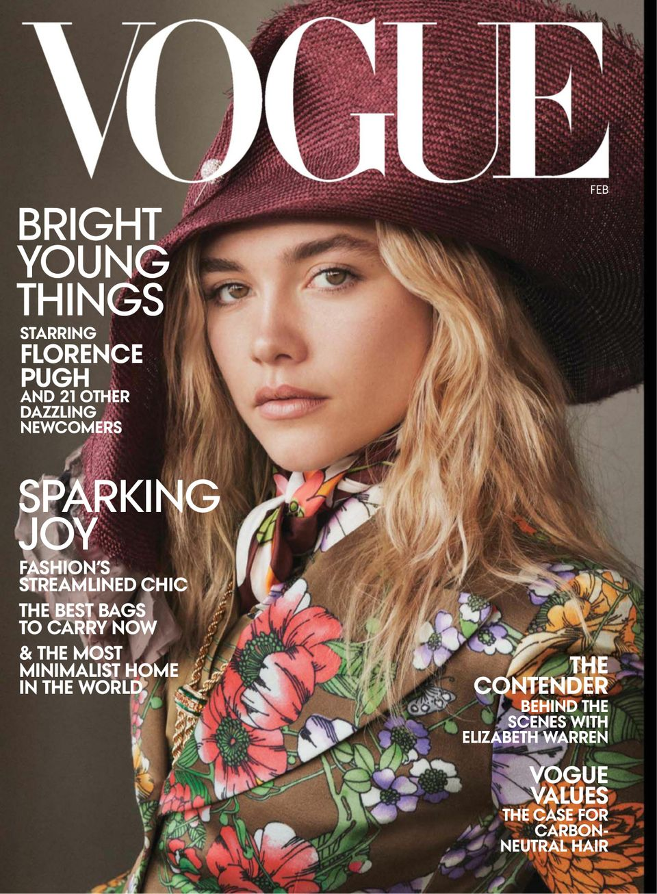
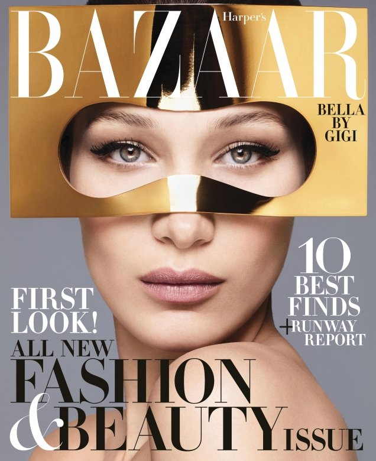
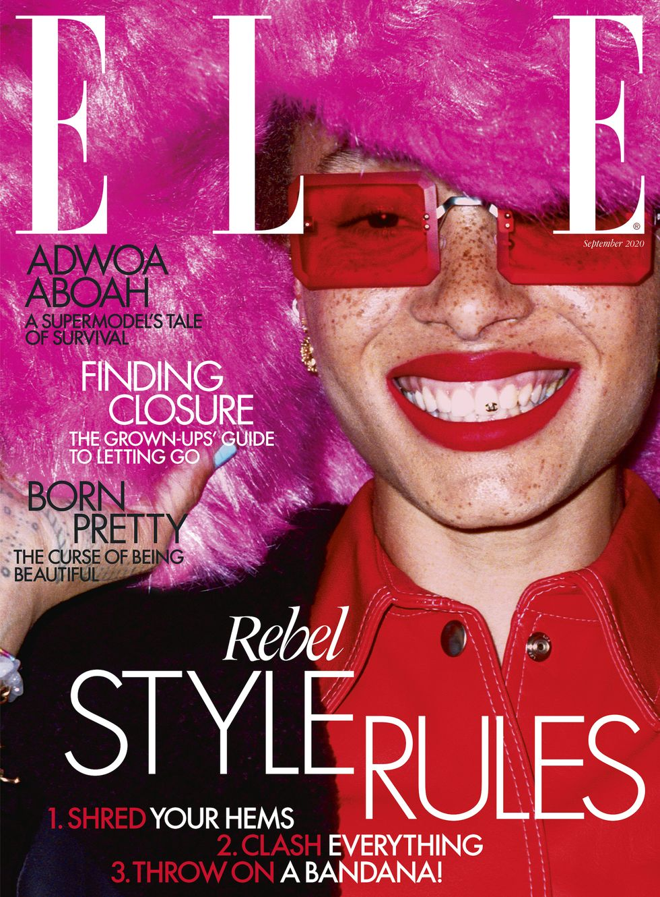
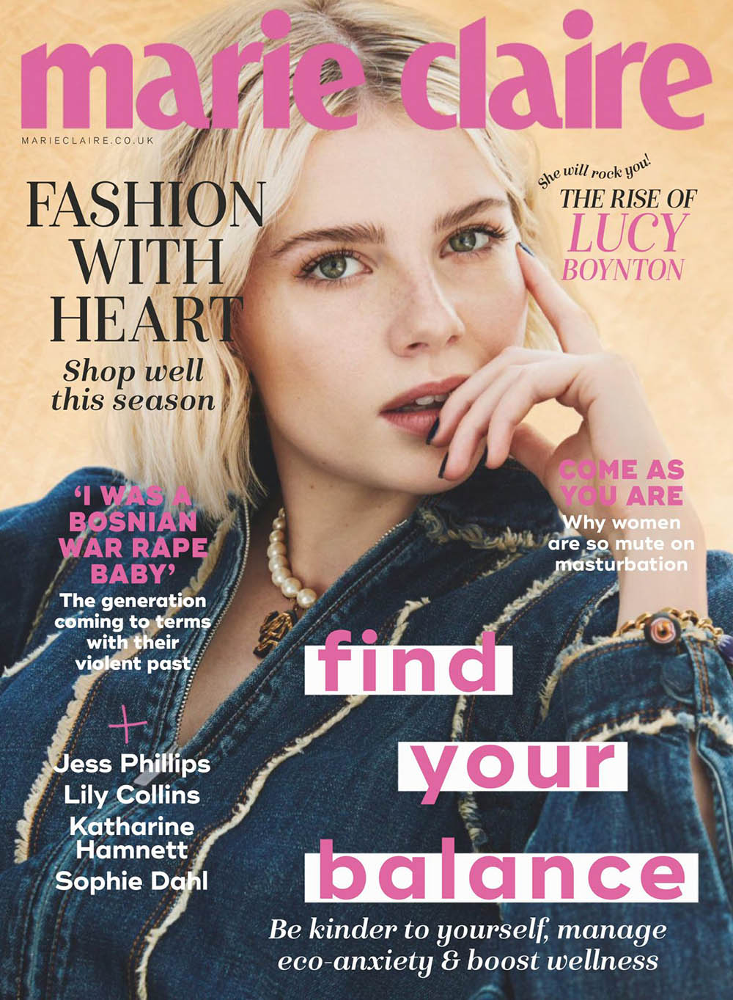

In efforts to provide some chronologicity to this blog, I thought I would start at the beginning of my love affair with magazines. *Vogue*, *Harper’s Bazaar*, *ELLE* and *Marie Claire* were what I considered to be the big four. Their pages were flooded with everything I wanted to be. Successful women wearing beautiful outfits that I would try to recreate from my mums (very basic) wardrobe, pictures of runway shows that resembled that of aliens landing on Earth- it was all so magical to me. This blog post will be looking at the relationship between magazine logos and their brand persona.

# **VOGUE**

*Vogue* Magazine uses a slightly modified version of the **Didone** font style. **Didone** is an elegant, classy and timeless typeface that resembles that of the brand. The cover of *Vogue* is simple and would aim to attract a demographic of women between 20-40.

Each *Vogue* cover typically features three varied fonts; the masthead font, a bold, coloured, sans-serif article title font, and a neutral, serif font that is used for sub-headings.

# **HARPER'S BAZAAR**

Similarly to *Vogue*, *Harper’s Bazaar* also uses a variation of the **Didone** typeface. The logo is very impactful, and is instantly recognisable, exuding elegance which reflects the brand beautifully due to its highbrow nature.

# ***ELLE***

*ELLE* magazine sports a **Didone** font, serif in nature. The bold, unwavering logo reflects the content inside *ELLE* magazine, as *ELLE* is infamous for unapologetically reporting on topical stories.

Often, the logo is hidden behind the cover girl, which shows the strength of the brand as it doesn’t always need to be seen to be known.

# **MARIE CLAIRE**

The *Marie Claire* logo is very similar to the style of Heroine Pro. The use of bold colouring and letters, as well as the feminine connotations of ‘*Marie Claire*,’ appeals directly to women. The serif is used makes the magazine more approachable than that of *Vogue* and *Harper’s Bazaar*.

The logos of successful magazines are always synonymous with their branding, this factor is likely to have contributed towards the unparalleled success of *Vogue*, *Harpers Bazaar*, *Elle* and *Marie Claire*.