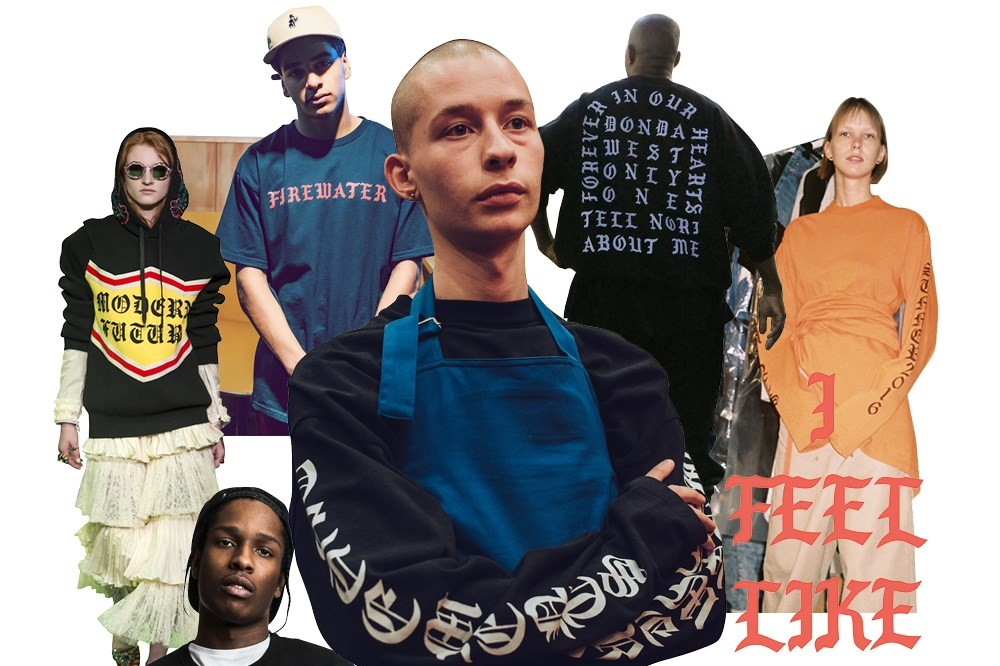

 

***`CYRILLIC SCRIPT:`***

*Gosha Rubinsky*, *Vetements* and just about every small Eastern Eurpoean designer have now embodied Cyrillic Script into their aestjetic. 

The type is a nod to the 90's post- Soviet generation and was prevolent in Russian streetwear brands before the 90's nostaliga became trendy. 

***`SIGNATURES:`***

Playful and scribbles and signatures can be seen on designers from *Alexander McQueen*, to *Yohji Yamamoto*.

***`OLD-ENGLISH FONT`***   

Palm Angels, Vetements, and Kanye West have taken to using gothic style letters to reference rap music and further enhance clothing collections.

The downside to any aesthetic is oversaturation, is when things become so ubiquitous their meaning is lost. How many wearing *Pablo* shirts know they are borrowing a style from Hispanic LA gangs, how many wearing Cyrillic printed fonts know the soviet heritage behind the aesthetic?