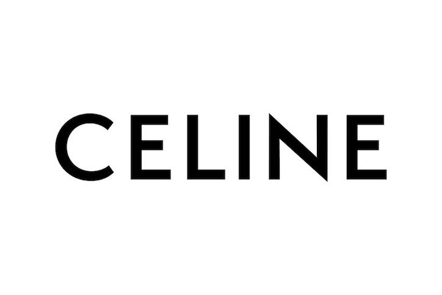

In 2018, French fashion house Celine revealed a new logo inspired by the brands identity in the 1960s. The logo redesign is the first major change for the brand in over 50 years. 

Celine revealed its new logo on Instagram, also deleting all previous Instagram posts. Celine has dropped the accented ‘E’ from its design, which has aims to ‘enable a simplified and more balanced proportion, evoking the Celine collections of the 1960’s. 

 

# ***`Analysis of the Typeface`***

 The logo is still bold, in capitals, with a sans-serif typeface. However, the letters are closer together which creates a more tightened effect. 

 

 

Hedi Slimane is the creative director responsible for the rebranding of Celine. Prior to his position at Celine, Slimane joined Yves Saint Laurent, where he rebranded the fashion house to Saint Laurent, rather than its original Yves Saint Laurent. 

It is clear that Slimane favours a cleaner and simpler aesthetic, however this has polarised many loyal fans and customers. The continuous evolution of a fashion brand is key for success, but Slimane appears to be stripping each brand from their authenticity. A variation of typography is needed in the high-end fashion industry.