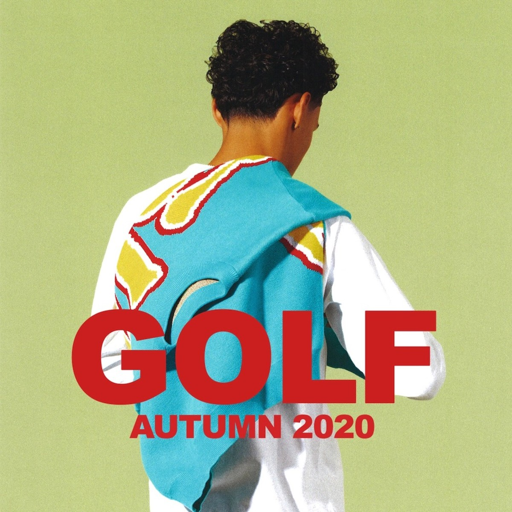
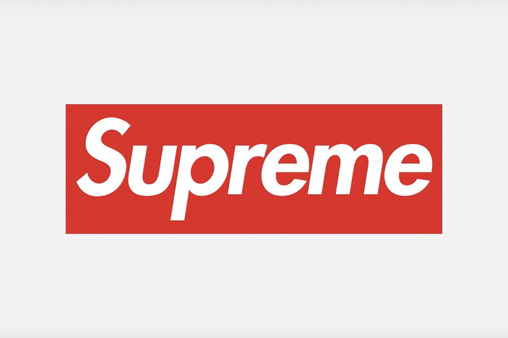
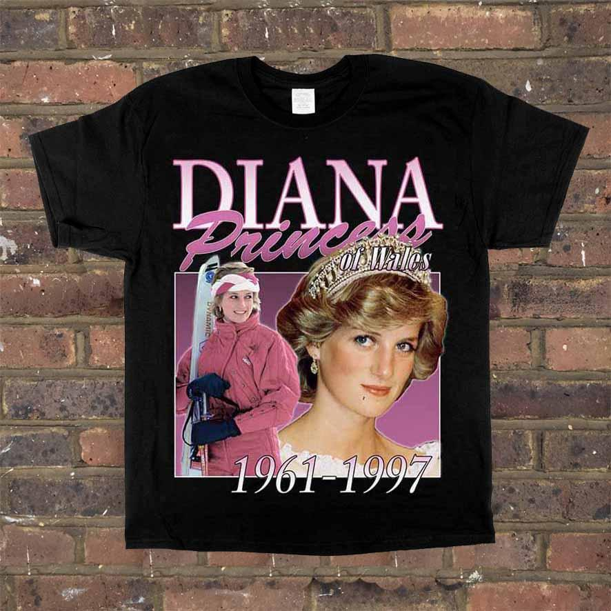
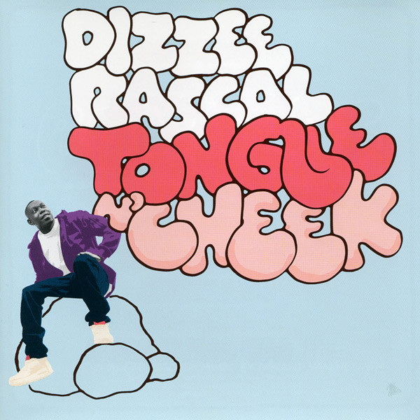
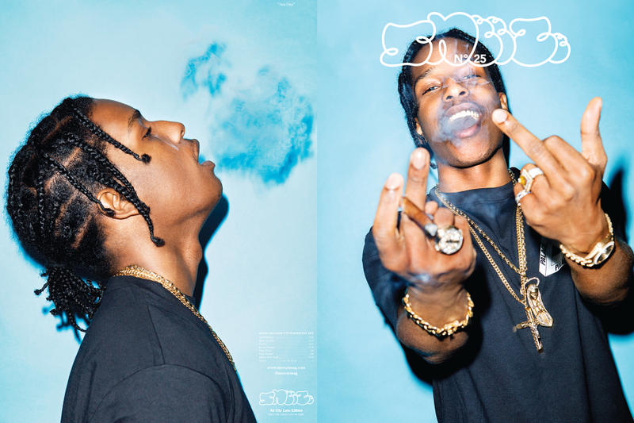
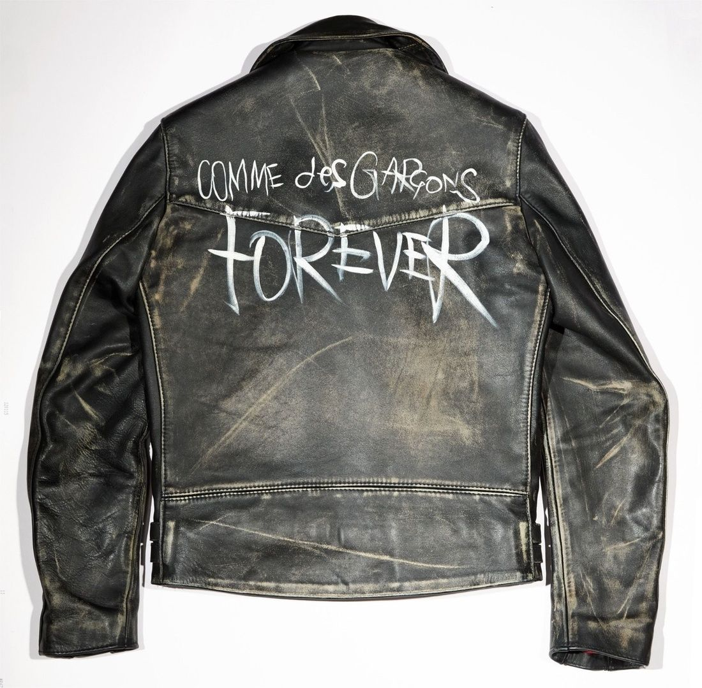
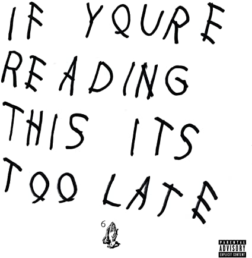

Typography is the main design element that can define and redefine a fashion brand. Typeface provides a word, but can also imply a feeling, time, place and attitude. Twenty-first century designers can often feel like everything has been done before, so where will they next look for inspiration, what will be the next big thing for fashion? 

Below are my predictions of fashions upcoming fonts:

# ***`BASICS`***

Bold headlines and clean- cut treatments are effective at capturing attention using sophistication and strength. The culture of fashion typography is heavily plagued by excessive visual stimulation. Today, it’s better to use big, bold branding than to have a customer dig for details.

This can be seen in streetwear brands like Golf Wang, who make use of accessible typefaces like aerial, and Supreme with the use of Futura. 

# ***`'Ugly Designs'`***

The ‘ugly’ design is making a comeback from its 90s Big Dogs moment. Stretched out letters, the mixing of mismatched loud and ornate typefaces and contrasting colours are all characteristics of this bizarre trend. This design is reminiscent of the early internet years, which is why it resonates with the fashion industry

# ***`Bubble Letters, or 'Softies'`*** 

The round letters were founded by 70’s Bronx graffiti writer Phase 2, who named the style of tags ‘softies’.

Phase 2 was heavily involved with the music scene, and inspired many rap and grime album artwork, including Dizzie Rascal.  

Bubble letters became more refined and mainstream, finding their way into the fashion consumer market, with the likes of SNEEZE and POPEYE championing the rounded letters. 

# ***`Bad Handwriting`***

Handwriting, especially untidy handwriting, can signify in terms of mood and expression the reflection of the world we live in. The return of bad handwriting could be considered a protest, as we have transitioned from looking at images on paper to images on screens, perhaps the modern process has become less human. 

 

But if something is seen as less human is it less expressive? There is something wildly poetic about words moving from heart to hand. The lengths of a pen stroke, size, angle give meaning to the physical relationship between the writer and their words. Digitally produced typography is the easy option; handwriting becomes a statement which could be why many designers have returned to it.