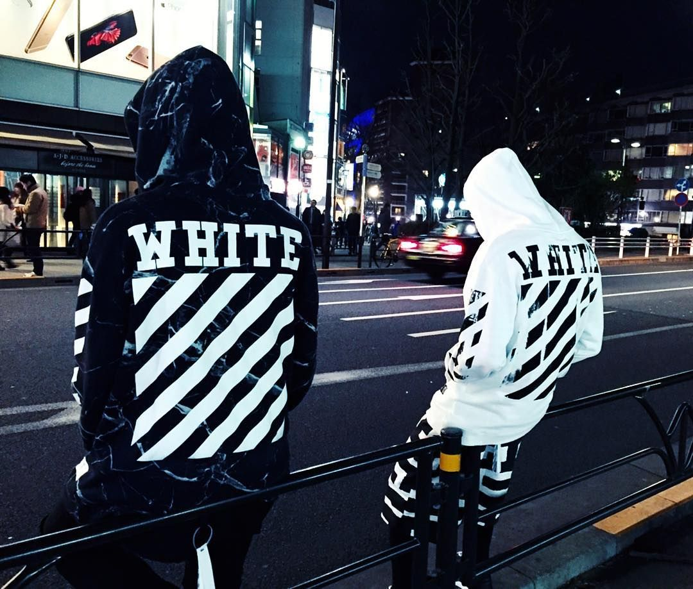
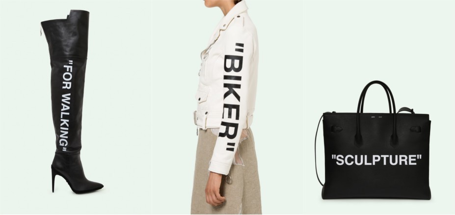
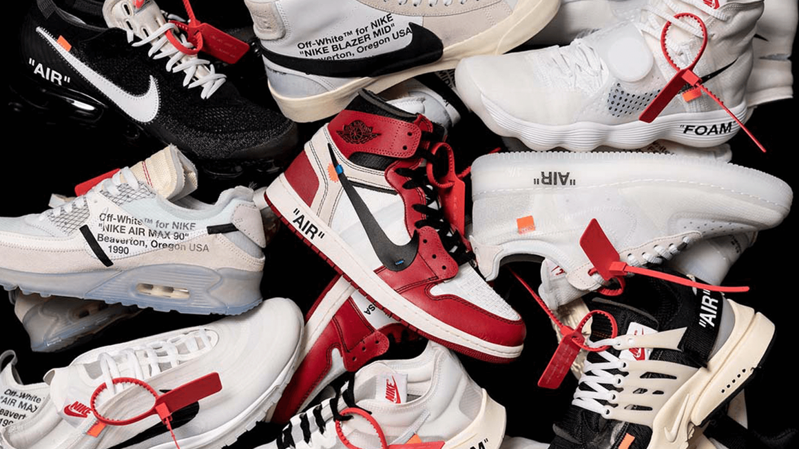

***“You can use typography and wording to completely change the perception of a thing without changing anything about it” -Virgil Abloh***

 

The current OFF- WHITE™ designs range from patchwork to graphic t-shirts, featuring the brands trademark stripes. Helvetica was chosen as the font due to the fact that it has become so ‘ubiquitous that it’s almost invisible.’

***`Quotations`***

OFF-WHITE™ uses quotations as citations to emphasise the perception of the garment. 

***`Nike Collaboration`*** 

The collaboration is comprised of ten classic NIKE trainers that have undergone a deconstructed makeover, making use of exposed layers and unfinished seams, which seems to be Virgil Abloah’s signature trademark design.

 

Typography can be utilised for interpretations. OFF-WHITE™ gives a systematic approach to looking at typography as an element that can be used to change the perception of what and wherever it is placed.