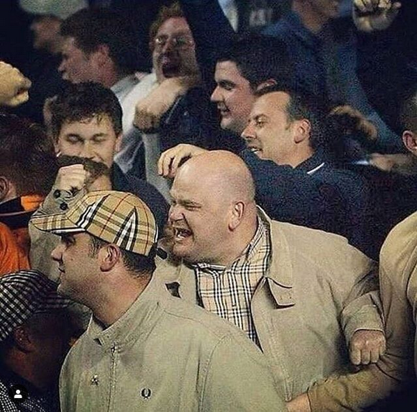
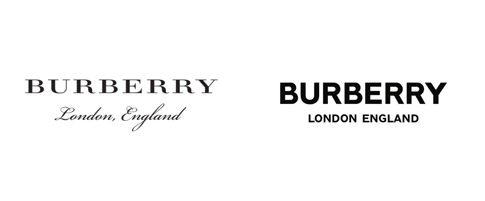

Subcultures play a pivotal role in the fashion realm. High end brands embody and rework them in accordance with their own style and vision.  The emergence of the so called ‘chavs’ had a huge impact aesthetically and economically to brands. 

Burberry is the epitome of English elegance, founded in 1856 its heritage lies in its iconic trench coats toff- like nature. However, its reputation is easily associated with lads, and to a lesser extent, hooligans due to the nature of nova check replicas in the 1980s. 

The directors of Burberry realised that the perception of the brand had to change, and so enlisted Peter Saville to rebrand the logo. 

# ***`Analysing the Typography`*** 

The new look is said to be inspired by Burberrys heritage in the form of a monogram Tisci found in archives from 1908. The monogram print is made up of T’s and B’s, which is a nod to Thomas Burberry. The colours are set in a bold palette of orange, brown and white. 

 However, the most extensive change lies in the logo. Saville decided to drop the iconic serif typeface and replaced it with a bold, capital, sans serif type. ‘England’ has also been added along with ‘London,’ replacing the knight; an image synonymous with the Burberry brand since 1909.   

The rebranding of Burberry is a result of the rise of digital consumerism. Screens are smaller, meaning certain serif fonts can become unreadable below a certain font size; Burberry is translating into a digital age. The modern-day chav aesthetic is now reworked and polished and is a huge part of the fashion system due to street fashion, social media and grime music. Skepta and Stormzy pioneered the tracksuit uniform, turning it into a more refined item that can be seen on catwalks worldwide. 

The Nike Air Max Tn is the perfect example of how Burberry as a brand has evolved to a more refined street style designer brand compared to that of the 80’s. 

