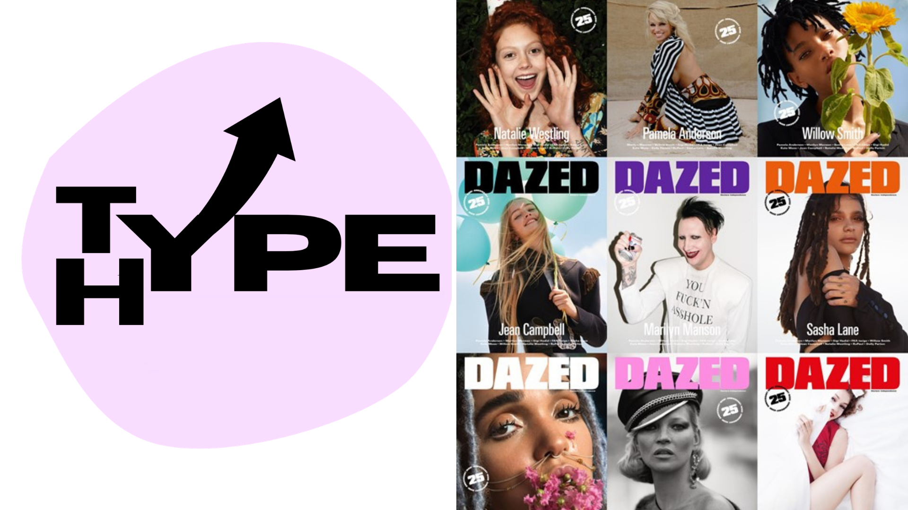
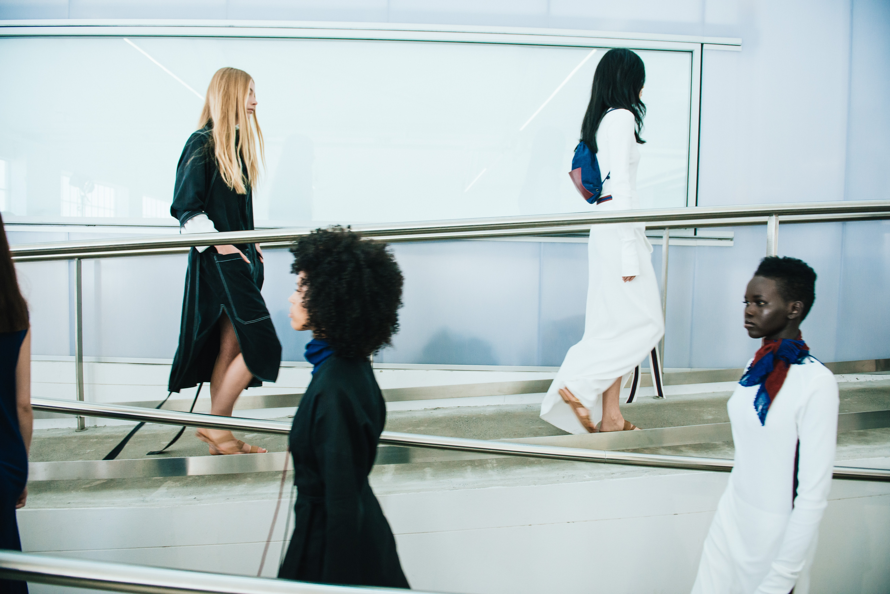
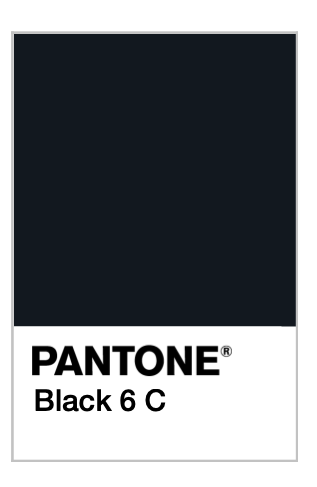
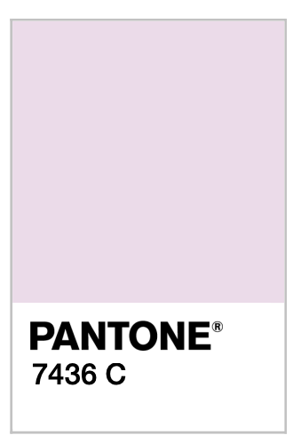

My name is Beth, I’m a second-year student at Oxford Brookes University studying journalism, media and publishing. I have decided to dedicate this blog to typography within the fashion industry.

The TypeHype logo was inspired by DAZED magazine. I utilised a plain- no nonsense font called ‘Horizon’ due to its clean looking, futuristic sans serif typeface. 

Similarly to the DAZED magazine logo, TypeHype has a futuristic minimalist feel, which can be reflected within current fashion trends.

According to Tom Wysocki, Typefaces are a major visual strategy for a text’s composers to signal the genre into which the text is to fit. In saying this, in the TypeHype logo, the use of Horizon reflects the content of the blog in its reporting of on- trend typography.

The TypeHype logo is minimalistic, which is reflected in the colours chosen. The black is bold, as to not detract the reader from anything else. 

While the lilac Pastel hues are very on- trend; An evolved, more adult take on millennial pink, ultra violet was crowned Pantone's colour of 2018 so the colour is perfect for the aesthetic blogs aesthetic. 

I will be updating the blog regularly, analysing typography in fashion through the use of print, digital, branding, editorial and advertising.